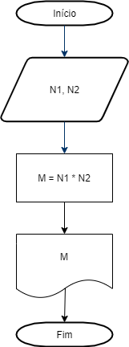
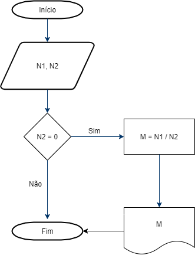
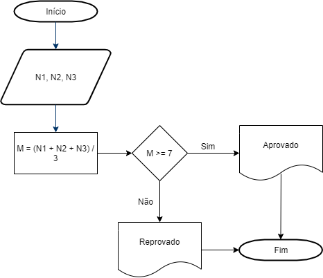

# Atividades
### 1. Faça um algoritmo para mostrar o resultado da multiplicação de dois números.

### 2. Faça um algoritmo para mostrar o resultado da divisão de dois números.

### 3. Faça um algoritmo para calcular a média aritmética entre três notas de um aluno. Este mesmo algoritmo deve mostrar a situação desse aluno, que pode ser aprovado ou reprovado. mêdia de aprovação é 7.

